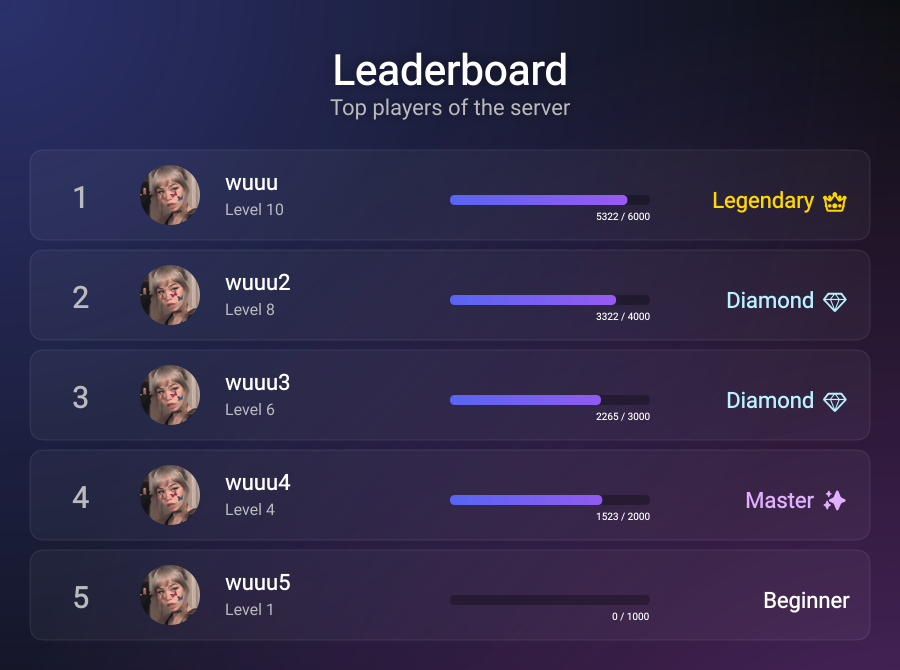

# canvas-leaderboard

A simple and intuitive Node.js library to generate leaderboard images with a fixed, classic layout. Automatic position and rank calculation makes it easier than ever.

## Features

- **Fluent Builder API**: Chain methods for an easy and readable configuration.
- **Automatic Positioning**: User position is automatically determined by their order in the array.
- **XP-Based Ranks**: Define rank tiers based on minimum XP, and the library will handle the rest.
- **Custom Styling**: Set colors for the XP bar, and choose between solid or gradient backgrounds.
- **Custom Fonts**: Register and use your own fonts.
- **Custom Font Styles**: Override default font styles for various text elements.
- **Podium Highlighting**: Special colors and icons for the top 3 players.
- **Header Customization**: Add a title and subtitle.

## Installation

```bash
npm install canvas-leaderboard
```

## Usage Example

```typescript
import { LeaderboardBuilder } from 'canvas-leaderboard';
import path from 'path';
import fs from 'fs';

// 1. Define your user data (position and rank are handled automatically)
const users = [
    { // Position 1
        avatarUrl: 'https://cdn.discordapp.com/avatars/937152156379803658/a_8930bcc29a2230ce24c494a08c217094.webp',
        nickname: 'wuuu',
        level: 10,
        xp: 2500, // Will be assigned 'Master' rank
        neededXp: 3000,
    },
    { // Position 2
        avatarUrl: 'https://cdn.discordapp.com/avatars/937152156379803658/a_8930bcc29a2230ce24c494a08c217094.webp',
        nickname: 'wuuu2',
        level: 8,
        xp: 1800, // Will be assigned 'Diamond' rank
        neededXp: 2000,
    },
    { // Position 3
        avatarUrl: 'https://cdn.discordapp.com/avatars/937152156379803658/a_8930bcc29a2230ce24c494a08c217094.webp',
        nickname: 'wuuu3',
        level: 5,
        xp: 900, // Will be assigned 'Pro' rank
        neededXp: 1000,
    },
    { // Position 4
        avatarUrl: 'https://cdn.discordapp.com/avatars/937152156379803658/a_8930bcc29a2230ce24c494a08c217094.webp',
        nickname: 'wuuu4',
        level: 3,
        xp: 600, // Will be assigned 'Beginner' rank
        neededXp: 800,
    },
    { // Position 5
        avatarUrl: 'https://cdn.discordapp.com/avatars/937152156379803658/a_8930bcc29a2230ce24c494a08c217094.webp',
        nickname: 'wuuu5',
        level: 1,
        xp: 100, // Will be assigned 'Beginner' rank
        neededXp: 200,
    },
];

// 2. Define your rank tiers
const rankTiers = [
    { name: 'Beginner', color: '#B9BBBE', minXp: 0 },
    { name: 'Pro ✨', color: '#5865F2', minXp: 1000 },
    { name: 'Diamond 💎', color: '#B9F2FF', minXp: 1500 },
    { name: 'Master 👑', color: '#E0B0FF', minXp: 2000 },
];

async function generateLeaderboard() {
    const imageBuffer = await new LeaderboardBuilder()
        .addFont(path.join(__dirname, 'fonts/Roboto-Regular.ttf'), { family: 'Roboto' })
        .addFont(path.join(__dirname, 'fonts/Roboto-Bold.ttf'), { family: 'Roboto', weight: 'bold' })
        .setBackground({ type: 'aurora', baseColor: '#0D0E12', aurora1Color: '#5865f2', aurora2Color: '#be4eea' })
        .setHeader({ title: 'Global Leaderboard', subtitle: 'Top players of the month' })
        .setXpBarColors({ primary: '#5865F2', secondary: '#A458F2' })
        .setFontStyles({
            headerTitle: 'bold 48px Roboto',
            userNickname: 'bold 22px Roboto',
            xpText: 'bold 10px Roboto',
        })
        .setRankTiers(rankTiers)
        .setPodium({
            colors: { first: '#FFD700', second: '#C0C0C0', third: '#CD7F32' },
        })
        .setUsers(users)
        .setLimit(5)
        .showRank(true)
        .build();

    fs.writeFileSync('leaderboard.png', imageBuffer);
    console.log('Leaderboard image generated!');
}

generateLeaderboard();
```

## Example Image




## API Reference

### `new LeaderboardBuilder()`
Creates a new builder instance. No parameters needed.

### `.addFont(path, options)`
- `path` (string): Path to the font file.
- `options` (object): `{ family, weight?, style? }`.

### `.setBackground(options)`
- `options` (`BackgroundOptions`): A color string (e.g., `'#151515'`), a gradient object (`GradientOptions`), or an aurora effect object (`AuroraBackgroundOptions`).
    - `GradientOptions`: `{ type: GradientType, colors: string[] }`
        - `type`: e.g., `'linear-left-right'`, `'radial'`
        - `colors`: An array of color strings, e.g., `['#ff0000', '#00ff00', '#0000ff']`
    - `AuroraBackgroundOptions`: `{ type: 'aurora', baseColor: string, spots: AuroraSpot[] }`
        - `type`: Must be `'aurora'`
        - `baseColor`: The base color of the background.
        - `spots`: An array of aurora spots.
            - `AuroraSpot`: `{ color: string, radius: number, x: number, y: number }`
                - `color`: The color of the spot.
                - `radius`: The radius of the spot.
                - `x`: The x-coordinate of the spot.
                - `y`: The y-coordinate of the spot.

### `.setHeader(options)`
- `options` (`HeaderOptions`): `{ title, subtitle? }`.

### `.setXpBarColors(colors)`
- `colors` (`XpBarColors`): `{ primary, secondary }` for the XP bar gradient.

### `.setFontStyles(styles)`
- `styles` (`FontStyles`): An object to customize font styles for various text elements.
    - `FontStyles`: `{ headerTitle?, headerSubtitle?, userNickname?, userLevel?, userPosition?, xpText?, rankText? }`
    - Each property accepts a CSS-like font string (e.g., `'bold 24px Arial'`).

### `.setRankTiers(tiers)`
- `tiers` (`RankTier[]`): An array of rank tiers. The library automatically assigns the correct rank based on user XP.
    - `RankTier`: `{ name, color, minXp }`

### `.setPodium(options)`
- `options` (`PodiumOptions`): Special styling for top 3.
    - `colors`: `{ first?, second?, third? }`
    
### `.setUsers(users)`
- `users` (`LeaderboardData[]`): Array of user data. **Sort them by rank before passing them to the builder.**

### `.setLimit(count)`
- `count` (number): Max number of users to display.

### `.showRank(visible)`
- `visible` (boolean): Set to `false` to hide the rank column.

### `.build()`
- Returns a `Promise<Buffer>` with the final PNG image data.

## License

ISC